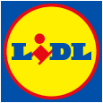

<!-- PROJECT LOGO -->
 

  

<h3 align="center">Lidl</h3>

  

    project_description
     
    <a href="https://github.com/sparthaa/lidl_NEW/blob/test/doc/documentation.md"><strong>Explore the docs »</strong></a>
     
     
    <a href="https://github.com/github_username/repo_name">View Demo</a>
    ·
    <a href="https://github.com/github_username/repo_name/issues">Report Bug</a>
    ·
    <a href="https://github.com/github_username/repo_name/issues">Request Feature</a>
  

Projeto realizado por:

* [Fabio Rodrigues](https://github.com/sparthaa)
* [Nuno Alves](https://github.com/alves95)
* [Pedro Silva](https://github.com/pedrosilva89)
